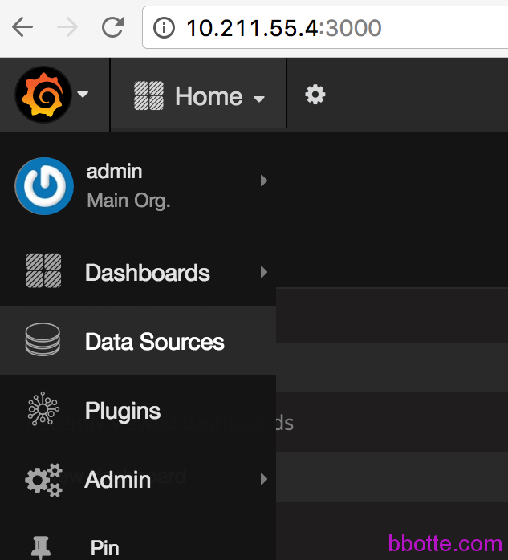
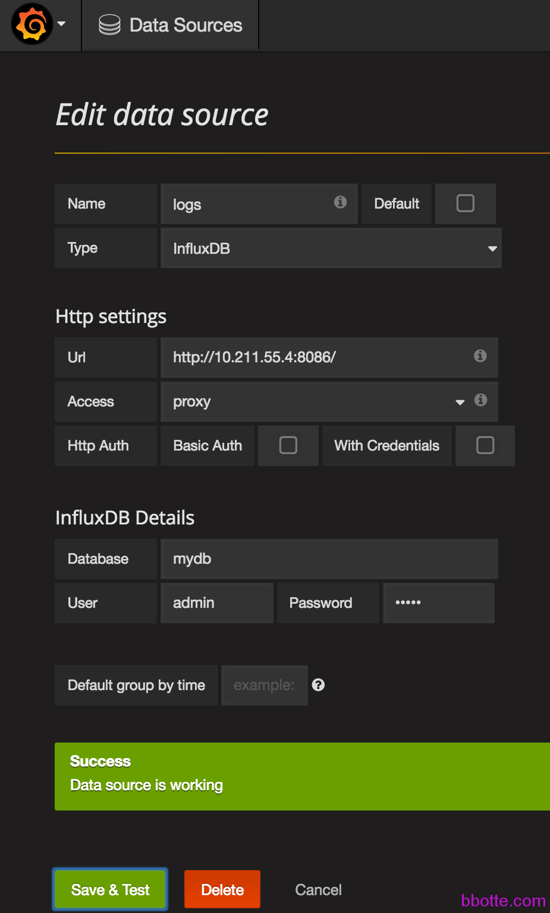
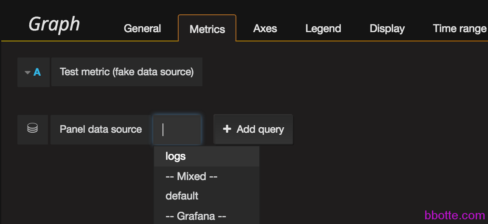
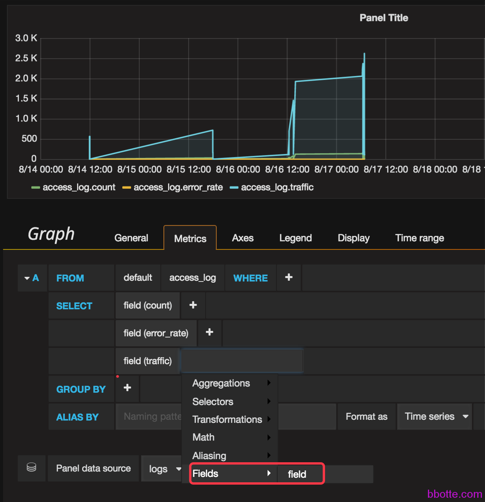

# python统计nginx日志的条数及错误率

以下内容为马哥教育comyn讲师讲解python的片段

目的：统计nginx日志在一定时间段内的数量和错误率，并展现出来

实现：用python脚本匹配nginx日志，计算日志条数和错误率，再借助于influxdb数据库和grafana图形展示

```
# rpm -ivh influxdb-0.13.0.x86_64.rpm
# rpm -ivh grafana-3.1.1-1470047149.x86_64.rpm
# /etc/init.d/influxdb start
# /etc/init.d/grafana-server start
```

```
先说一下influxdb用法
新建一个数据库test
# curl -i -XPOST http://localhost:8086/query --data-urlencode "q=CREATE DATABASE test"
向test数据库 cpu_load_short表写入host、region标签，字段value，时间戳
# curl -i -XPOST 'http://localhost:8086/write?db=test' --data-binary 'cpu_load_short,host=server01,region=us-west value=0.64 1434055562000000000'
当然也可以不加tag标签，甚至不加时间戳，用系统的时间作为时间戳
# curl -i -XPOST 'http://localhost:8086/write?db=test' --data-binary 'cpu_load_short value=0.78'
查询数据库
# curl -GET 'http://localhost:8086/query?pretty=true' --data-urlencode "db=test" --data-urlencode "q=SELECT value FROM cpu_load_short WHERE region='us-west'"
```

influxdb创建一个日志状态的数据库库

```
curl -i -XPOST http://localhost:8086/query --data-urlencode "q=CREATE DATABASE mydb"
 
或者进入influxdb数据库创建
# influx
> create database mydb
> show databases
name: databases
---------------
name
_internal
mydb
> use mydb
> show measurements      #可理解为mysql的show tables
```

下面是python分析nginx日志脚本

```
#!/usr/bin/env python
#ecoding=utf8
#python 3以上版本
#curl -i -XPOST http://localhost:8086/query --data-urlencode "q=CREATE DATABASE mydb"
import os
import re
import datetime
import threading
import requests
import sys
 
'''nginx默认的日志格式
log_format  main  '$remote_addr - $remote_user [$time_local] "$request" '
                  '$status $body_bytes_sent "$http_referer" '
                  '"$http_user_agent" "$http_x_forwarded_for"';
'''
 
o = re.compile(r'(?P<ip>\d{1,3}\.\d{1,3}\.\d{1,3}\.\d{1,3}) .* .* \[(?P<time>.*)\] "(?P<method>\w+) (?P<url>[^\s]*) (?P<version>[\w|/\.\d]*)" (?P<status>\d{3}) (?P<length>\d+) "(?P<referer>[^\s]*)" "(?P<ua>.*)"')
 
def read_log(path):
    offset = 0
    event = threading.Event()
    while not event.is_set():
        with open(path) as f:
            if offset > os.stat(path).st_size:
                offset = 0
            f.seek(offset)
            yield from f
            offset = f.tell()
        event.wait(2)
 
 
def parse(path):
    for line in read_log(path):
        m = o.search(line.rstrip('\n'))
        if m:
            data = m.groupdict()
            yield data
 
 
def aggregate(path, interval=10):
    count = 0
    traffic = 0
    error = 0
    start = datetime.datetime.now()
    for item in parse(path):
        count += 1
        traffic += int(item['length'])
        if int(item['status']) >= 300:
            error += 1
        current = datetime.datetime.now()
        print((current - start).total_seconds())
        if (current - start).total_seconds() >= interval:
             error_rate = error / count
             send(count, traffic, error_rate)
             start = current
             count = 0
             traffic = 0
             error = 0
 
 
def send(count, traffic, error_rate):
    line = 'access_log count={},traffic={},error_rate={}'.format(count, traffic, error_rate)
    print(line)
    res = requests.post('http://127.0.0.1:8086/write', data=line, params={'db': 'mydb'})
    if res.status_code >= 300:
        print(res.content)
 
if __name__ == '__main__':
    aggregate(sys.argv[1])
```

yield用法可以查看此链接<https://docs.python.org/3/reference/expressions.html#yieldexpr>

yield from f  == for i in f:    yield i

上述python脚本 https://github.com/bbotte/bbotte.github.io/blob/master/nginx_log_error_rate_statistics.py，有客户端访问nginx服务生成日志，执行python脚本，

```
(3.4.4/envs/py) [root@vm01 work]# python logs.py /var/log/nginx/test.log
8.008
8.008099
8.008152
10.008779
access_log count=163,traffic=2370,error_rate=0.09202453987730061
0.009928
0.009998
2.010602
2.010705
8.013663
10.014418
access_log count=15,traffic=120,error_rate=0.3333333333333333
0.007235
2.007849
2.007943
...
```

下面为grafana图形化的展示配置

浏览器打开http://IP:3000/，配置数据库





influxdb数据库名称写mydb，下面用户名密码就是admin，admin。数据库源添加完毕再点击dashboards–new。在出现的图表左上角，点击绿色竖条的菜单栏–Add Panel–Graph，将出现默认的一个图标样式。



如上图，选择刚添加的数据名称，再编辑数据库语句




添加3个field，count、error_rate，traffic，把group by删除就会看到图形化的展示，上面执行的数据库语句为 SELECT “count”, “error_rate”, “traffic” FROM “access_log” WHERE $timeFilter ，修改完毕保存即可

2016年08月18日 于 [linux工匠](http://www.bbotte.com/) 发表


