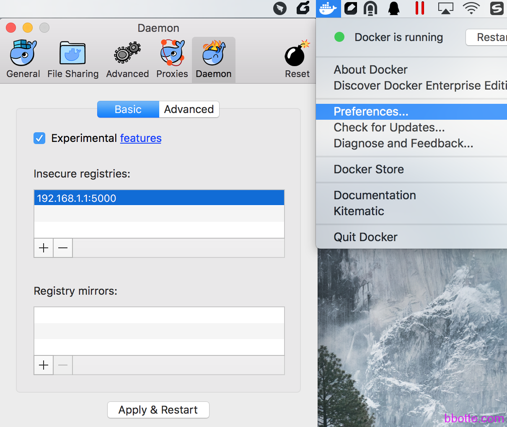

# MAC系统Docker镜像构建和私有仓库

### 说明

Docker镜像构建和私有仓库，对CentOS系统一样适合

Docker镜像构建:系统OS X EI Capitan 10.11.6,  docker Version: 17.03.1-ce

私有仓库: 系统CentOS Linux release 7.2.1511,  docker Version: 1.12.6

### 下载并安装Docker.dmg

[https://www.docker.com/docker-mac ](https://www.docker.com/docker-mac)

安装过程可参考 <https://docs.docker.com/docker-for-mac/#general>

现在已经用不到Boot2Docker-1.8.0.pkg、 DockerToolbox.pkg 、VirtualBox-4.3.40-110317-OSX.dmg 这些软件了，只需要下载安装Docker.dmg即可

### 编写Dockerfile

比如我们需要建立一个nginx的docker镜像

```
# vim Dockerfile
FROM centos:centos6
MAINTAINER matuoyi <bbotte@163.com>
 
RUN yum -y install openssh-server epel-release && \
    yum -y install pwgen && \
    rm -f /etc/ssh/ssh_host_dsa_key /etc/ssh/ssh_host_rsa_key && \
    ssh-keygen -q -N "" -t dsa -f /etc/ssh/ssh_host_dsa_key && \
    ssh-keygen -q -N "" -t rsa -f /etc/ssh/ssh_host_rsa_key && \
    sed -i "s/#UsePrivilegeSeparation.*/UsePrivilegeSeparation no/g" /etc/ssh/sshd_config && \
    sed -i "s/UsePAM.*/UsePAM no/g" /etc/ssh/sshd_config
 
ADD nginx.repo /etc/yum.repos.d/nginx.repo
RUN yum -y install nginx
 
RUN set -x && \
    yum clean all && \
    rm -rf /tmp/* /var/cache/{yum,ldconfig} && \
    rm -rf /var/cache/yum/x86_64/6/* && \
    find /var/log -type f -delete
 
ADD test.conf /etc/nginx/conf.d/default.conf
ADD index.html /var/www/nginx/index.html
ADD nginx.conf /etc/nginx/nginx.conf
 
ADD authorized_keys /root/.ssh/authorized_keys
RUN chmod 700 /root/.ssh && \
    chmod 600 /root/.ssh/authorized_keys
ADD set_root_pw.sh /set_root_pw.sh
 
ADD run.sh /run.sh
RUN chmod +x /*.sh
 
ENV AUTHORIZED_KEYS **None**
 
EXPOSE 22 80
CMD ["/run.sh"]
 
#Dockerfile 到此已经写完
 
#run.sh脚本
cat run.sh               
#!/bin/bash
if [ ! -f /.root_pw_set ]; then
	/set_root_pw.sh
fi
/etc/init.d/nginx start
exec /usr/sbin/sshd -D
 
#set_root_pw.sh脚本
cat set_root_pw.sh      
#!/bin/bash
 
if [ -f /.root_pw_set ]; then
	echo "Root password already set!"
	exit 0
fi
 
PASS=${ROOT_PASS:-$(pwgen -s 12 1)}
_word=$( [ ${ROOT_PASS} ] && echo "preset" || echo "random" )
echo "Setting a ${_word} password to the root user"
echo "root:$PASS" | chpasswd
echo "Done!"
touch /.root_pw_set
echo "ssh -p port root@host"
echo "and enter the root password '$PASS' when prompted"
```

```
touch authorized_keys 把公钥写里面
 
# cat nginx.repo
[nginx]
name=nginx repo
baseurl=http://nginx.org/packages/centos/6/$basearch/
gpgcheck=0
enabled=1
 
# cat nginx.conf
user  nginx;
worker_processes  auto;
 
error_log  /var/log/nginx/error.log warn;
pid        /var/run/nginx.pid;
 
events {
    use epoll;
    worker_connections  65535;
}
 
http {
    include       /etc/nginx/mime.types;
    default_type  application/octet-stream;
 
    log_format  main  '$remote_addr - $remote_user [$time_local] "$request" '
                      '$status $body_bytes_sent "$http_referer" '
                      '"$http_user_agent" "$http_x_forwarded_for"';
 
    sendfile        on;
    #tcp_nopush     on;
 
    keepalive_timeout  60;
    client_max_body_size 20m;
 
    ssl_session_cache   shared:SSL:10m;
    ssl_session_timeout 10m;
 
     server_names_hash_bucket_size 128;
     client_header_buffer_size 32k;
     large_client_header_buffers 4 32k;
     client_header_timeout 10;
     client_body_timeout 10;
     reset_timedout_connection on;
     send_timeout 10;
 
     tcp_nopush     on;
     tcp_nodelay on;
     gzip on;
     gzip_min_length  1k;
     gzip_buffers     4 16k;
     gzip_http_version 1.0;
     gzip_comp_level 2;
     gzip_types     text/plain application/x-javascripttext/css application/xml;
     gzip_vary on;
     gzip_proxied        expired no-cache no-store private auth;
     gzip_disable        "MSIE [1-6]\.";
 
     open_file_cache max=102400 inactive=30s;
     open_file_cache_valid 90s;
     open_file_cache_min_uses 2;
     open_file_cache_errors on;
 
     proxy_set_header Host $host;
     proxy_set_header X-Real-IP $remote_addr;
     proxy_set_header X-Forwarded-For $proxy_add_x_forwarded_for;
     proxy_hide_header X-Frame-Options;
     proxy_hide_header X-XSS-Protection;
     proxy_http_version 1.1;
     proxy_set_header Connection "";
     proxy_set_header PROXY "";
     proxy_connect_timeout 3s;
     proxy_read_timeout 8s;
     proxy_send_timeout 8s;
     proxy_buffering on;
     proxy_buffer_size 128k;
     proxy_buffers 16 128k;
     proxy_busy_buffers_size 128k;
     proxy_temp_file_write_size 1024k;
     proxy_hide_header X-Powered-By;
 
     server_tokens off;
 
    include /etc/nginx/conf.d/*.conf;
}
 
 
# cat test.conf
server {
 
        listen  80 default_server;
       # server_name www.bbotte.com;
        index index.html;
        root  /var/www/nginx;
 
        access_log  /var/log/nginx/test.log main;
        error_page  404 = /404.html;
}
 
# cat index.html
123456
```

构建docker镜像

```
docker build -t bbotte/nginx:v1 .
docker save -o bbotte-nginx.tar bbotte/nginx:v1
scp bbotte-nginx.tar 192.168.1.1:/root
```

我们需要建立一个私有仓库，假如仓库的ip是192.168.1.1

### docker建立私有仓库

```
yum install docker docker-registry -y
docker search registry
docker pull docker.io/registry
mkdir -p /opt/registry
docker run -d -v /opt/registry:/var/lib/registry -p 5000:5000 --restart=always --name registry docker.io/registry
 
此时docker registry已经运行，我们导入构建的docker镜像
docker load < bbotte-nginx.tar
docker tag bbotte/nginx:1 192.168.1.1:5000/bbotte/nginx:v1
docker push 192.168.1.1:5000/bbotte/nginx:v1
```

此时，在MAC端或者其他docker客户端拉取这个镜像

```
docker pull 192.168.1.1:5000/bbotte/nginx:v1
docker run -d --name my-nginx -p 5522:22 -p 80:80 -v ~/html:/data/html 192.168.1.1:5000/bbotte/nginx:v1
 
docker stop my-nginx 停止docker容器
docker start my-nginx 启动docker容器
docker rm my-nginx 删除此docker容器
```

查看镜像

```
# curl -XGET http://registry:5000/v2/_catalog
# curl -XGET http://registry:5000/v2/image_name/tags/list
```

### 遇到的问题

1，Dockerfile文件有问题的话，构建的时候会有提示，比如returned a non-zero code: 1，按提示处理即可

2，docker私有仓库 docker push 时候提示：

```
docker push 192.168.1.1:5000/bbotte/nginx
The push refers to a repository [192.168.1.1:5000/bbotte/nginx]
Get https://192.168.1.1:5000/v1/_ping: http: server gave HTTP response to HTTPS client
```

解决方法：

```
cat /etc/docker/daemon.json
{ "insecure-registries":["192.168.1.1:5000"] }
systemctl restart docker
```

更改docker内网ip段：

```
# cat /etc/docker/daemon.json 
{
  "bip": "172.18.0.1/16",
  "fixed-cidr": "172.18.0.0/16",
  "insecure-registries": ["hub.customerindex.alauda.cn:5000"]
}
```

3，MAC docker客户端docker pull拉取不下来

```
docker pull 192.168.1.1:5000/bbotte/nginx:1
Using default tag: latest
Error response from daemon: Get https://192.168.1.1:5000/v1/_ping: http: server gave HTTP response to HTTPS client
```

打开已安装的docker，点击docker的菜单‘Preference’—-‘Daemon’—-‘Insecure registries:’—-点击‘+’输入”192.168.1.1:5000″—-点击‘Apply & Restart’



4，删除docker registry中的镜像

```
curl -I -X DELETE http://IP:PORT/v2/ImagesName/manifests/ID
```

删除的时候提示：

```
curl -I -X DELETE http://192.168.200.69:5000/v2/echo/php7/manifests/sha256:014668014...
HTTP/1.1 405 Method Not Allowed
```

需要修改registry的配置

```
docker ps
CONTAINER ID        IMAGE                    COMMAND                  CREATED             STATUS              PORTS                                      NAMES
2635fa19ad84        docker.io/registry       "/entrypoint.sh /etc/"   45 hours ago        Up 27 hours         0.0.0.0:5000->5000/tcp                     registry
 
docker exec -it registry /bin/sh
/ # vi /etc/docker/registry/config.yml
storage:
  cache:
    blobdescriptor: inmemory
  filesystem:
    rootdirectory: /var/lib/registry
  delete:
    enabled: true
/ # exit
docker restart registry
curl -I -X DELETE http://192.168.1.1:5000/v2/bbotte/nginx/manifests/sha256:014668014...
HTTP/1.1 202 Accepted
```

5, docker中运行php服务，日志提示：

ERROR: failed to ptrace(ATTACH) child 113: Operation not permitted (1)

docker在运行的时候添加下面3种参数的一种

- `docker run --security-opt=seccomp:unconfined no_trace`
- `docker run --privileged no_trace`
- `docker run --cap-add SYS_PTRACE no_trace`

docker run -d –cap-add SYS_PTRACE -name bbotte -p 22:22 bbotte/nginx:1

2017年04月28日 于 [linux工匠](http://www.bbotte.com/) 发表