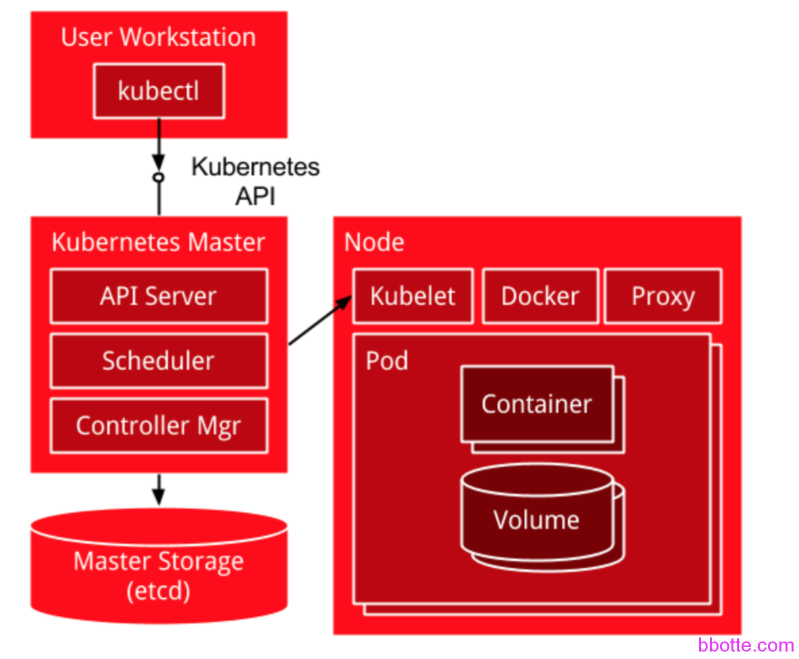
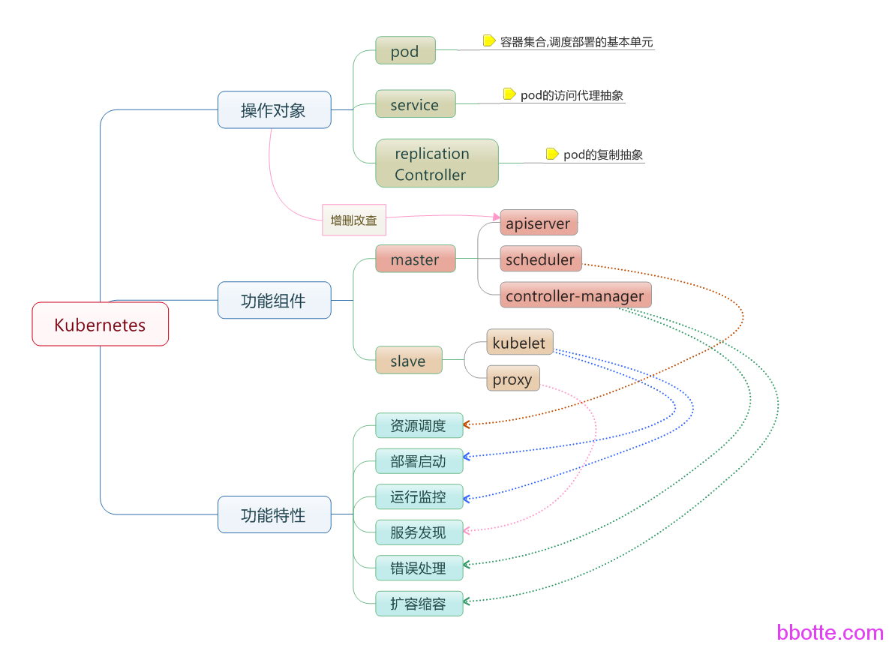
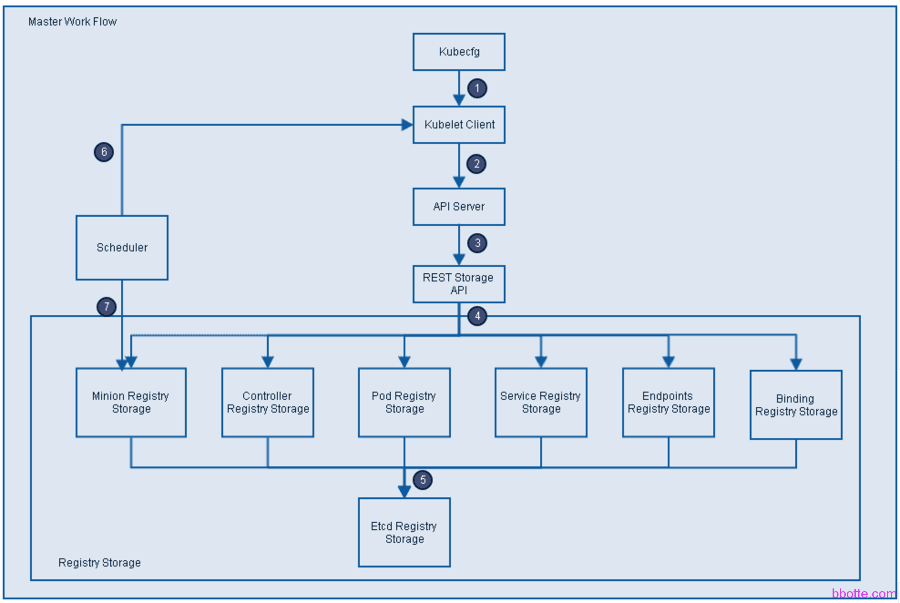
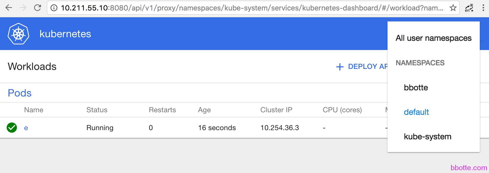
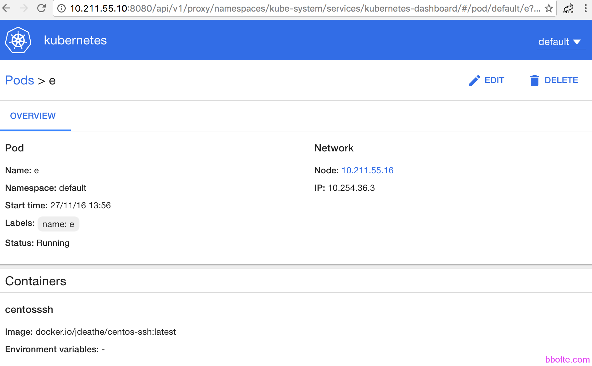

# docker服务在kubernetes(k8s)中跑起来

1. 说明
2. kubernetes(k8s)的安装
3. kubernetes(k8s)的相关配置
4. 启动kubernetes(k8s)服务
5. 查看状态
6. kubernetes(k8s)的dashboard
7. kubernetes(k8s)管理docker容器

### 说明

docker单独使用比较简单明了，可参看上一篇[docker初学跟我来](http://bbotte.com/kvm-xen/flow-me-learning-docker/)，是关于docker命令的使用方法，包括镜像拉取、容器运行、打包等。

kubernetes(k8s)是docker容器用来编排和管理的工具，就像openstack对于kvm来说一个意思。组织结构如下



我们通过kubectl向k8s Master发出指令。kubernetes Master主要是提供API Server、Scheduler、Controller组件，接收kubectl的命令，从Node节点获取Node的资源信息，并发出调度任务。Node节点提供kubelet、kube-proxy，每个node节点都安装docker，是实际的执行者。kubernetes不负责网络，所以一般是用flannel或者weave。etcd负责服务发现和node信息存储，下面开始：

**本文适用于kubernetes1.2–1.5版本**，安装后的版本为：

```
# cat /etc/centos-release
CentOS Linux release 7.2.1511 (Core)
# docker -v
Docker version 1.12.2, build bb80604
# etcdctl -v
etcdctl version 2.3.7
# flanneld -version
0.5.3
# kubectl version
Client Version: version.Info{Major:"1", Minor:"2", GitVersion:"v1.2.0", GitCommit:"ec7364b6e3b155e78086018aa644057edbe196e5", GitTreeState:"clean"}
Server Version: version.Info{Major:"1", Minor:"2", GitVersion:"v1.2.0", GitCommit:"ec7364b6e3b155e78086018aa644057edbe196e5", GitTreeState:"clean"}
```

### **一，kubernetes(k8s)的安装**



2台或者3台，一台作为kubernetes(k8s)的Master主，其他作为运行docker容器的节点(kubernetes Node节点)，下面以2台主机为例

- **Master**: A Kubernetes Master is where you direct API calls to services that control the activities of the pods, replications controllers, services, nodes and other components of a Kubernetes cluster. Typically, those calls are made by running **kubectl** commands. From the Master, containers are deployed to run on Nodes.

```
# cat /etc/centos-release
CentOS Linux release 7.2.1511 (Core)
# yum install vim vim-enhanced wget lrzsz bc mutt ntpdate sysstat dstat wget man mail mlocate mtr lsof iotop iptraf net-tools -y
# sed -i 's/SELINUX=enforcing/SELINUX=disabled/g' /etc/selinux/config
# ntpdate ntp1.aliyun.com
# systemctl disable firewalld
# systemctl stop firewalld
# tee /etc/yum.repos.d/docker.repo <<-'EOF'
[dockerrepo]
name=Docker Repository
baseurl=https://yum.dockerproject.org/repo/main/centos/7/
enabled=1
gpgcheck=1
gpgkey=https://yum.dockerproject.org/gpg
EOF
# yum install docker kubernetes-master etcd flannel
 
kube-apiserver           kube-controller-manager  kubectl                  kube-scheduler
通过-h 查看其用法
```

这里[etcd](https://github.com/coreos/etcd) 和zookeeper、consul一样用来实现服务发现的功能

etcd is a distributed, consistent key-value store for shared configuration and service discovery, with a focus on being:

- *Simple*: well-defined, user-facing API (gRPC)
- *Secure*: automatic TLS with optional client cert authentication
- *Fast*: benchmarked 10,000 writes/sec
- *Reliable*: properly distributed using Raft

[flannel](https://github.com/coreos/flannel) 实现不同主机网络互通

flannel is a virtual network that gives a subnet to each host for use with container runtimes.

Platforms like Kubernetes assume that each container (pod) has a unique, routable IP inside the cluster. The advantage of this model is that it reduces the complexity of doing port mapping.



- **Node**: A Node is a system providing the run-time environments for the containers. A set of container pods can span multiple nodes.

```
# yum install docker kubernetes-node flannel -y
 
kubectl     kubelet     kube-proxy
通过-h 查看其用法
```

### **二，kubernetes(k8s)的相关配置**

**Master:**

```
# egrep -v "^$|^#" /etc/etcd/etcd.conf
ETCD_NAME=default
ETCD_DATA_DIR="/var/lib/etcd/default.etcd"
ETCD_LISTEN_CLIENT_URLS="http://0.0.0.0:2379"
ETCD_ADVERTISE_CLIENT_URLS="http://MASTER_IP:2379"
 
# egrep -v "^$|^#" /etc/kubernetes/apiserver
KUBE_API_ADDRESS="--insecure-bind-address=0.0.0.0"
KUBE_ETCD_SERVERS="--etcd-servers=http://MASTER_IP:2379"
KUBE_SERVICE_ADDRESSES="--service-cluster-ip-range=10.254.0.0/16"
KUBE_ADMISSION_CONTROL="--admission-control=NamespaceLifecycle,NamespaceExists,LimitRanger,SecurityContextDeny,ResourceQuota"
#KUBE_ADMISSION_CONTROL的ServiceAccount 选项删掉了
KUBE_API_ARGS=""
 
# egrep -v "^$|^#" /etc/kubernetes/config
KUBE_LOGTOSTDERR="--logtostderr=true"
KUBE_LOG_LEVEL="--v=0"
KUBE_ALLOW_PRIV="--allow-privileged=false"
KUBE_MASTER="--master=http://MASTER_IP:8080"
 
# egrep -v "^$|^#" /etc/sysconfig/flanneld
FLANNEL_ETCD="http://MASTER_IP:2379"
FLANNEL_ETCD_KEY="/kube/network"
```

**Node:**

```
# egrep -v "^$|^#" /etc/kubernetes/config
KUBE_LOGTOSTDERR="--logtostderr=true"
KUBE_LOG_LEVEL="--v=0"
KUBE_ALLOW_PRIV="--allow-privileged=false"
KUBE_MASTER="--master=http://MASTER_IP:8080"
 
# egrep -v "^$|^#" /etc/kubernetes/kubelet
KUBELET_ADDRESS="--address=0.0.0.0"
KUBELET_HOSTNAME="--hostname-override=NODE_IP"
KUBELET_API_SERVER="--api-servers=http://MASTER_IP:8080"
KUBELET_POD_INFRA_CONTAINER="--pod-infra-container-image=registry.access.redhat.com/rhel7/pod-infrastructure:latest"
KUBELET_ARGS=""
 
# egrep -v "^$|^#" /etc/sysconfig/flanneld
FLANNEL_ETCD="http://MASTER_IP:2379"
FLANNEL_ETCD_KEY="/kube/network"
```

### **三，启动kubernetes(k8s)服务**

**Master: **

只有flanneld服务是高可用，其他都是单机，线上需要设置集群，保证高可用

```
# vim master_start.sh
#!/bin/bash
for i in docker etcd flanneld kube-apiserver kube-controller-manager kube-scheduler;do
systemctl restart ${i}
systemctl status ${i}
done
```

\# sh master_start.sh

**Node:**

```
# vim node_start.sh
#!/bin/bash
for i in docker flanneld kube-proxy kubelet;do
systemctl restart ${i}
systemctl status ${i}
done
```

\# sh node_start.sh

flanneld 0.71版本和0.6用起来有些不一样的问题：

```
# flanneld -version
0.7.1
# vim /etc/sysconfig/flanneld
FLANNEL_ETCD_ENDPOINTS="http://MASTER_IP:2379"
FLANNEL_ETCD_PREFIX="/kube/network"
 
启动etcd服务后，建立目录
# etcdctl mkdir /kube/network
# etcdctl mk /kube/network/config "{ \"Network\": \"172.30.0.0/16\", \"SubnetLen\": 24, \"Backend\": { \"Type\": \"vxlan\" } }"
{ "Network": "172.30.0.0/16", "SubnetLen": 24, "Backend": { "Type": "vxlan" } }
# systemctl restart flanneld
```

### **四，查看状态**

```
在master上
# curl localhost:8080
{
  "paths": [
    "/api",
    "/api/v1",
    "/apis",
    "/apis/autoscaling",
    "/apis/autoscaling/v1",
    "/apis/batch",
    "/apis/batch/v1",
    "/apis/extensions",
    "/apis/extensions/v1beta1",
    "/healthz",
    "/healthz/ping",
    "/logs/",
    "/metrics",
    "/resetMetrics",
    "/swagger-ui/",
    "/swaggerapi/",
    "/ui/",
    "/version"
  ]
 
# curl localhost:8080/healthz/ping
ok
 
# kubectl get nodes
NAME           STATUS     AGE
NODE_IP   Ready      6d
 
# kubectl cluster-info
Kubernetes master is running at http://localhost:8080
```

在master上新建一个namespace

```
# cat kube-namespace.yaml
{
"kind": "Namespace",
"apiVersion": "v1",
"metadata": {
"name": "bbotte"
  }
}
 
# kubectl create -f kube-namespace.yaml
namespace "bbotte" created
 
# kubectl get namespace
NAME          STATUS    AGE
bbotte        Active    36s
default       Active    6d
 
# kubectl get svc --namespace=bbotte
NAME                   CLUSTER-IP     EXTERNAL-IP   PORT(S)   AGE
kubernetes-dashboard   10.254.11.33   nodes         80/TCP    6d
```

### **五，kubernetes(k8s)的dashboard**

```
#参考https://github.com/kubernetes/dashboard
# kubectl get pods --all-namespaces | grep dashboard
# kubectl create -f https://rawgit.com/kubernetes/dashboard/master/src/deploy/kubernetes-dashboard.yaml
# kubectl proxy
浏览器访问 http://MASTER_IP:8001/ui
```

镜像请这里下载：docker pull daocloud.io/gfkchinanetquest/kubernetes-dashboard-amd64:v1.5.1 ，或者从其他渠道，本文和此docker没有任何关系

kubernetes-dashboard.yaml内容如下：

```
# Copyright 2015 Google Inc. All Rights Reserved.
#
# Licensed under the Apache License, Version 2.0 (the "License");
# you may not use this file except in compliance with the License.
# You may obtain a copy of the License at
#
#     http://www.apache.org/licenses/LICENSE-2.0
#
# Unless required by applicable law or agreed to in writing, software
# distributed under the License is distributed on an "AS IS" BASIS,
# WITHOUT WARRANTIES OR CONDITIONS OF ANY KIND, either express or implied.
# See the License for the specific language governing permissions and
# limitations under the License.
 
# Configuration to deploy release version of the Dashboard UI.
#
# Example usage: kubectl create -f <this_file>
 
kind: Deployment
apiVersion: extensions/v1beta1
metadata:
  labels:
    app: kubernetes-dashboard
  name: kubernetes-dashboard
  namespace: kube-system      #请修改为上面创建的namespace：bbotte
spec:
  replicas: 1
  selector:
    matchLabels:
      app: kubernetes-dashboard
  template:
    metadata:
      labels:
        app: kubernetes-dashboard
      # Comment the following annotaion if Dashboard must not be deployed on master
      annotations:
        scheduler.alpha.kubernetes.io/tolerations: |
          [
            {
              "key": "dedicated",
              "operator": "Equal",
              "value": "master",
              "effect": "NoSchedule"
            }
          ]
    spec:
      containers:
      - name: kubernetes-dashboard
        image: gcr.io/google_containers/kubernetes-dashboard-amd64:v1.5.0-beta1
        imagePullPolicy: Always
        ports:
        - containerPort: 9090
          protocol: TCP
        args:
          # Uncomment the following line to manually specify Kubernetes API server Host
          # If not specified, Dashboard will attempt to auto discover the API server and connect
          # to it. Uncomment only if the default does not work.
          # - --apiserver-host=http://my-address:port
        - --apiserver-host=http://MASTER_IP:port  #这一行为添加修改为本机的ip，端口自定义
        livenessProbe:
          httpGet:
            path: /
            port: 9090
          initialDelaySeconds: 30
          timeoutSeconds: 30
---
kind: Service
apiVersion: v1
metadata:
  labels:
    app: kubernetes-dashboard
  name: kubernetes-dashboard
  namespace: kube-system
spec:
  type: NodePort
  ports:
  - port: 80
    targetPort: 9090
  selector:
    app: kubernetes-dashboard
#请参考https://rawgit.com/kubernetes/dashboard/master/src/deploy/kubernetes-dashboard.yaml
 
# kubectl create -f kube-dashboard.yaml
 
通过http://MASTER_IP:port/ui 访问dashboard
```

**warning**: 第一次创建service后，查看计算节点的docker服务一般不会成功，因为计算节点需要拉取registry.access.redhat.com/rhel7/pod-infrastructure 208.6 MB，所以等一小时后，再来查看kube-dashboard状态吧

```
kubectl get pods --namespace=kube-system
ContainerCreating
 
Warning	FailedSync	Error syncing pod, skipping: failed to "StartContainer" for "POD" with ErrImagePull: "image pull failed for registry.access.redhat.com/rhel7/pod-infrastructure:latest, this may be because there are no credentials on this request.  details: (open /etc/docker/certs.d/registry.access.redhat.com/redhat-ca.crt: no such file or directory)"
```

或者先下载此docker镜像，导入到各个节点避免这个问题

```
kubectl get pods --namespace=kube-system
```

### **六，kubernetes(k8s)管理docker容器**

上一篇文章已经有了自己打包的docker image，那么把这个image导入到**Node****主机**中

```
导入之前保存docker image包
# cat centos-ssh.tar |docker import - jdeathe/centos-ssh
# docker images
REPOSITORY                                            TAG                 IMAGE ID            CREATED             SIZE
jdeathe/centos-ssh                                    latest              08127872471f        5 days ago          238.3 MB

```

如果没有已有的image，那就从网上pull吧，我这里是为了节省时间才导入，上面导入这一段可以忽略，接着往下看

Node主机中运行哪些docker，在MASTER主机上用yaml文件控制，比如下面在Master主机上：

```
# cat e.yaml
apiVersion: v1         #通过命令kubectl api-versions 查看
kind: Pod
metadata:
  labels:
    name: centos
  name: centos
spec:
  containers:
  - name: centosssh                             #名字而已
    image: docker.io/jdeathe/centos-ssh:latest  #拉取的docker镜像，后面必须加版本号
    #imagePullPolicy: Always
    imagePullPolicy: Never
    ports:
    - containerPort: 22    #容器内的端口
      hostPort: 8022       #映射到主机的端口/对外映射的端口
```

```
# kubectl create -f e.yaml
# kubectl get pods --namespace=default
NAME      READY     STATUS              RESTARTS   AGE
e         0/1       Pending             0          5d
 
# kubectl describe pods e --namespace=default  #查看详细信息，恩，这里面信息很重要
```

在Node主机上查看运行的docker：

```
# docker ps|grep 8022
d288a71b097e        registry.access.redhat.com/rhel7/pod-infrastructure:latest   "/pod"                   50 minutes ago      Up 50 minutes       0.0.0.0:8022->22/tcp   k8s_POD.eb1d0b0f_d_default_494c43e7-b0a0-11e6-9a52-001c42f65f0f_c2cb804e
```

在Master主机上登录，下面登录只针对docker.io/jdeathe/centos-ssh这个image

```
# curl -LSs https://raw.githubusercontent.com/mitchellh/vagrant/master/keys/vagrant > id_rsa_insecure
# chmod 600 id_rsa_insecure
# ssh -p 8022 -i id_rsa_insecure app-admin@10.211.55.16
The authenticity of host '[10.211.55.16]:8022 ([10.211.55.16]:8022)' can't be established.
ECDSA key fingerprint is 55:14:84:4c:e3:ff:82:d8:6e:1a:e6:43:4e:42:f6:9e.
Are you sure you want to continue connecting (yes/no)? yes
Warning: Permanently added '[10.211.55.16]:8022' (ECDSA) to the list of known hosts.
[app-admin@d ~]$ id
uid=500(app-admin) gid=500(app-admin) groups=500(app-admin),10(wheel),100(users)
[app-admin@d ~]$
```

或者我们用其他的image

```
# vim nginx.yaml
apiVersion: v1
kind: Pod
metadata:
  name: nginx
spec:
  containers:
  - name: nginx
    image: nginx
    ports:
    - containerPort: 80
 
# kubectl create -f nginx.yaml
 
# kubectl get pods --namespace=default
 
# kubectl describe pods nginx --namespace=default
```

因为从网上下载docker的image比较慢，有时候可能下载不下来，那么Node主机里面docker ps就没有启动的容器，一直等到下载完成便会自动启动，所以上面我用了导入以前的镜像方式，当然一般公司都是自建docker仓库

在Node主机上查看运行docker的信息：

```
# docker images
REPOSITORY                                            TAG                 IMAGE ID            CREATED             SIZE
jdeathe/centos-ssh                                    latest              08127872471f        5 days ago          238.3 MB
docker.io/nginx                                       latest              05a60462f8ba        2 weeks ago         181.4 MB
registry.access.redhat.com/rhel7/pod-infrastructure   latest              7d5548e9fb99        3 weeks ago         205.3 MB
docker.io/jdeathe/centos-ssh                          latest              9ec062aab4b6        8 weeks ago         230.3 MB
daocloud.io/minunix/kubernetes-dashboard-amd64        v1.1.1              7763d19c0041        3 months ago        55.83 MB
 
root@localhost ~]# docker ps|grep 8022
d288a71b097e        registry.access.redhat.com/rhel7/pod-infrastructure:latest   "/pod"                   About an hour ago   Up About an hour    0.0.0.0:8022->22/tcp   k8s_POD.eb1d0b0f_d_default_494c43e7-b0a0-11e6-9a52-001c42f65f0f_c2cb804e
[root@localhost ~]# docker inspect d288a71b097e   #这个命令也经常用，有大量的信息
... 略，请仔细看，比较重要
 
# docker inspect -f '{{.NetworkSettings.IPAddress}}' d288a71b097e
10.254.21.2
 
[root@localhost ~]# ssh -i id_rsa_insecure app-admin@10.254.21.2
The authenticity of host '10.254.21.2 (10.254.21.2)' can't be established.
ECDSA key fingerprint is 55:14:84:4c:e3:ff:82:d8:6e:1a:e6:43:4e:42:f6:9e.
Are you sure you want to continue connecting (yes/no)? yes
Warning: Permanently added '10.254.21.2' (ECDSA) to the list of known hosts.
[app-admin@d ~]$ id
uid=500(app-admin) gid=500(app-admin) groups=500(app-admin),10(wheel),100(users)
[app-admin@d ~]$
```

上面是说k8s创建并启动docker容器，怎么删除呢：

```
# kubectl get pods --namespace=default
NAME      READY     STATUS             RESTARTS   AGE
a         0/1       RunContainerError   0          5d
b         0/1       Pending            0          5d
 
# kubectl delete pods a --namespace=default
pod "a" deleted
 
# kubectl get pods --namespace=default
NAME      READY     STATUS             RESTARTS   AGE
b         0/1       Pending            0          5d
 
如果是默认的namespace， kubectl delete pods a  这样更干脆
删除kube-system namespace包含dashboard的服务
kubectl -n kube-system delete $(kubectl -n kube-system get pod -o name | grep dashboard)
```

删除之后，再去Node主机中docker ps查看吧

附kubernetes(k8s)的dashboard





红帽的[getting started with kubernetes](https://access.redhat.com/documentation/en/red-hat-enterprise-linux-atomic-host/7/paged/getting-started-with-kubernetes/chapter-1-get-started-orchestrating-containers-with-kubernetes)

k8s官网文档<https://kubernetes.io/docs/getting-started-guides/centos/centos_manual_config/>

pdf英文文档链接：https://pan.baidu.com/s/1jIhVoTS

度娘网盘链接：https://pan.baidu.com/s/1dGtFguX 密码: 5dut

2016年11月27日 于 [linux工匠](http://www.bbotte.com/) 发表